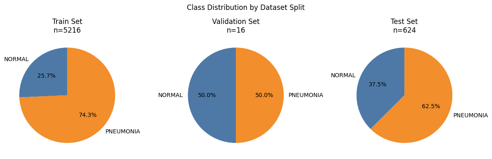
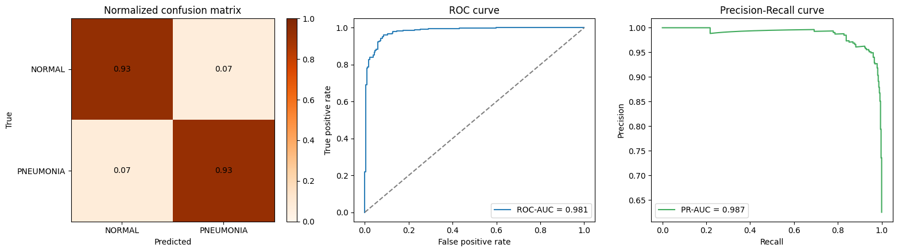

# Pneumonia Detection with PyTorch (ResNet18)

This project trains a transfer-learning classifier to detect **pneumonia** vs **normal** chest X-rays using a ResNet18 backbone in PyTorch.

## Dataset

The project uses the Kaggle dataset [`paultimothymooney/chest-xray-pneumonia`](https://www.kaggle.com/datasets/paultimothymooney/chest-xray-pneumonia).

Download and extract:

```bash
kaggle datasets download -d paultimothymooney/chest-xray-pneumonia -p ./data
unzip ./data/chest-xray-pneumonia.zip -d ./data
```

Expected raw folder structure:

```text
data/
  train/
    NORMAL/
    PNEUMONIA/
  val/
    NORMAL/
    PNEUMONIA/
  test/
    NORMAL/
    PNEUMONIA/
```

### Class distribution across splits



Notes:
- The original Kaggle split is class-imbalanced.
- The original validation split is very small, so the notebook now regenerates patient-level train/val/test splits before training.

## Data Pipeline

### 1. Dataset loading
- A custom `PneumoniaDataset` class loads images from indexed records.
- Labels are encoded as:
  - `0` for `NORMAL`
  - `1` for `PNEUMONIA`
- Images are converted to RGB and transformed with `torchvision`.

### 2. Patient-level split regeneration
- The notebook indexes all images from the raw dataset folders.
- Patient IDs are inferred from filename conventions (for example `person###` for pneumonia files).
- Train/validation/test splits are built at patient level (no patient appears in multiple splits).
- Validation/test class presence is enforced, and pneumonia subtype coverage is validated when available.

### 3. Augmentation and preprocessing

Training transform:
- `Resize(256, 256)`
- `RandomResizedCrop(224, scale=(0.8, 1.0))`
- `RandomHorizontalFlip()`
- `RandomRotation(10)`
- `ColorJitter(brightness=0.2, contrast=0.2)`
- `ToTensor()`
- ImageNet normalization

Validation/test transform:
- `Resize(224, 224)`
- `ToTensor()`
- ImageNet normalization


### 4. Imbalance handling
- Uses class-weighted `CrossEntropyLoss`.

## Model Architecture

Backbone:
- `torchvision.models.resnet18` with ImageNet pretrained weights (`IMAGENET1K_V1`)

Fine-tuning strategy:
- Freeze all layers initially.
- Unfreeze `layer3`, `layer4`, and classifier head for training.

Classification head:
- Replace final FC block with:
  - `Dropout(p=0.3)`
  - `Linear(in_features=512, out_features=2)`

## Training Setup

- Batch size: `32`
- Learning rate: `1e-4`
- Max epochs: `20`
- Early stopping patience: `5`
- Optimizer: `AdamW` (`weight_decay=1e-4`)
- LR scheduler: `ReduceLROnPlateau`

## Evaluation

The notebook evaluates with:
- ROC-AUC
- PR-AUC
- Accuracy / F1
- Sensitivity / Specificity / PPV / NPV
- Brier score
- Bootstrap confidence intervals

Post-hoc calibration:
- Temperature scaling is fit on validation logits after training.
- Validation and test probabilities are recalibrated before threshold selection/evaluation.
- Calibration quality is checked with validation NLL and Brier score (raw vs calibrated).

Thresholding behavior:
- The decision threshold is selected on the validation set using a high-sensitivity policy.
- If the sensitivity target is not feasible, it falls back to best F1.




## Results

- Learned temperature: `1.912755`
- Validation NLL: `0.221162 -> 0.181493`
- Validation Brier: `0.060714 -> 0.056551`
- Selected threshold: `0.059` (`sensitivity_constrained`)

Test metrics:

| Metric | Value |
|---|---:|
| Accuracy | 0.9679 |
| F1 | 0.9777 |
| Sensitivity | 0.9826 |
| Specificity | 0.9304 |
| PPV | 0.9729 |
| NPV | 0.9545 |
| ROC-AUC | 0.9938 |
| PR-AUC | 0.9976 |
| Brier | 0.0625 |

Class-wise report (support: `NORMAL=158`, `PNEUMONIA=402`):
- NORMAL: precision `0.95`, recall `0.93`, F1 `0.94`
- PNEUMONIA: precision `0.97`, recall `0.98`, F1 `0.98`

## Setup & Usage

### 1) Install dependencies

```bash
uv sync
```

### 2) Open and run `src/resnet18.ipynb`

## Artifacts

- Trained weights: `src/models/model.pth`
